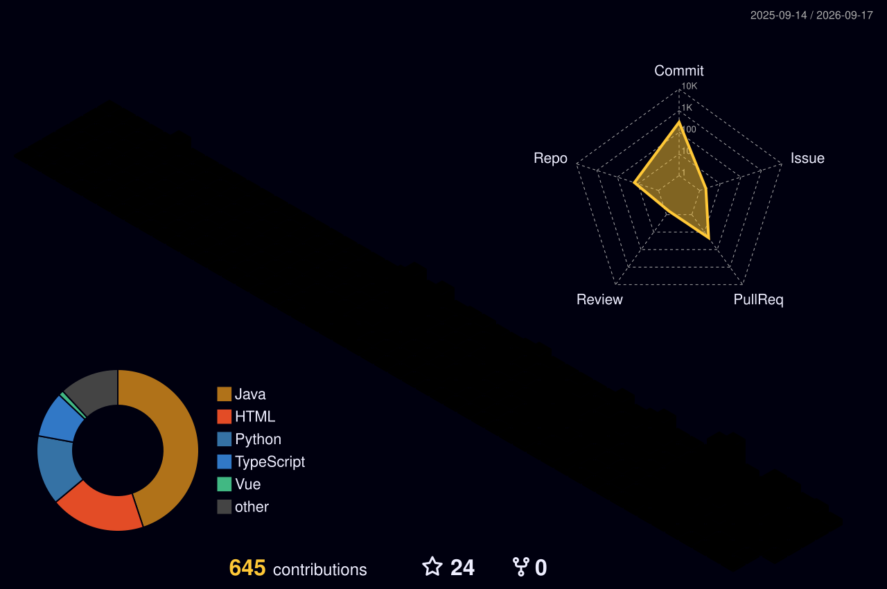

<!-- ==================== PROFILE HEADER ==================== -->

<picture>
  <source
    media="(prefers-color-scheme: dark)"
    srcset="./assets/profile-header-dark-v2.svg"
  />
  <source
    media="(prefers-color-scheme: light)"
    srcset="./assets/profile-header-light-v2.svg"
  />
  
</picture>

  <strong>Building practical tools for real-world workflows.</strong> 
  Exploring systems, automation and open-source software · 开源繁荣，共建共享

<!-- ==================== TOOLBOX ==================== -->

<strong>Toolbox</strong>

<!-- ==================== 3D CONTRIBUTIONS ==================== -->

<strong>Contribution Landscape</strong>

<picture>
  <source
    media="(prefers-color-scheme: dark)"
    srcset="./profile-3d-contrib/profile-night-rainbow.svg"
  />
  <source
    media="(prefers-color-scheme: light)"
    srcset="./profile-3d-contrib/profile-season-animate.svg"
  />
  
</picture>

<!-- ==================== GITHUB SNAPSHOT ==================== -->

<strong>GitHub Snapshot</strong>

  <picture>
    <source
      media="(prefers-color-scheme: dark)"
      srcset="https://github-stats-extended.vercel.app/api?username=iamkuangzhang&show_icons=true&include_all_commits=true&rank_icon=github&hide_border=true&bg_color=00000000&title_color=22D3EE&icon_color=818CF8&text_color=C9D1D9"
    />
    <source
      media="(prefers-color-scheme: light)"
      srcset="https://github-stats-extended.vercel.app/api?username=iamkuangzhang&show_icons=true&include_all_commits=true&rank_icon=github&hide_border=true&bg_color=00000000&title_color=0891B2&icon_color=4F46E5&text_color=475569"
    />
    
  </picture>
  <picture>
    <source
      media="(prefers-color-scheme: dark)"
      srcset="https://github-stats-extended.vercel.app/api/top-langs/?username=iamkuangzhang&layout=compact&langs_count=8&hide_border=true&bg_color=00000000&title_color=22D3EE&text_color=C9D1D9"
    />
    <source
      media="(prefers-color-scheme: light)"
      srcset="https://github-stats-extended.vercel.app/api/top-langs/?username=iamkuangzhang&layout=compact&langs_count=8&hide_border=true&bg_color=00000000&title_color=0891B2&text_color=475569"
    />
    
  </picture>

<!-- ==================== COUNTERS ==================== -->

Building useful software, one experiment at a time.

